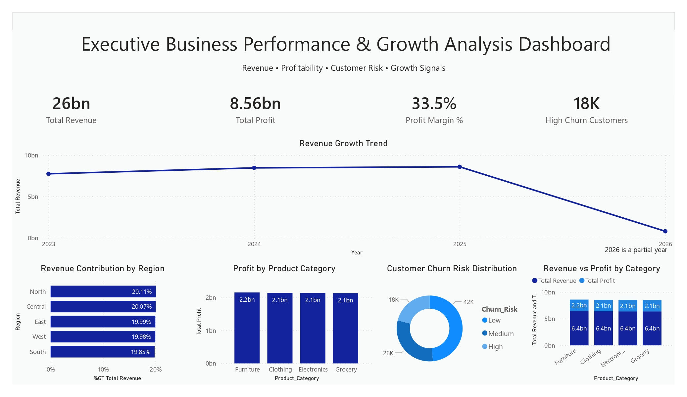

# Executive Business Performance & Growth Analysis Dashboard

## Project Overview

This Power BI dashboard provides a comprehensive executive-level view of business performance, profitability, customer churn risk, and revenue growth trends. It enables business leaders to monitor financial health, identify growth opportunities, and make strategic decisions using data-driven insights.

---

## Dashboard Preview

---

## Business Objectives

- Monitor revenue and profitability performance.
- Analyze customer churn risk.
- Track business growth trends over time.
- Evaluate regional revenue contribution.
- Compare product category profitability.
- Support executive decision-making and strategic planning.

---

## Key Metrics

| KPI | Value |
|------|--------|
| Total Revenue | $26 Billion |
| Total Profit | $8.56 Billion |
| Profit Margin | 33.5% |
| High Churn Customers | 18,000 |

---

## Dashboard Features

### 1. Revenue Growth Trend
Tracks revenue performance across multiple years to identify:

- Growth patterns
- Revenue fluctuations
- Long-term business trends

---

### 2. Regional Revenue Contribution
Analyzes revenue distribution across:

- North
- South
- East
- West
- Central

Provides visibility into regional business performance.

---

### 3. Product Category Profitability
Measures profit generated by key product categories:

- Furniture
- Clothing
- Electronics
- Grocery

Helps identify the most profitable business segments.

---

### 4. Customer Churn Risk Analysis
Segments customers based on churn risk:

- Low Risk
- Medium Risk
- High Risk

Supports retention planning and customer success initiatives.

---

### 5. Revenue vs Profit Comparison
Compares:

- Revenue Contribution
- Profit Contribution

across product categories to evaluate operational efficiency.

---

## Key Insights

### Financial Performance
- Total revenue exceeds **$26 Billion**.
- Business generates **$8.56 Billion** in profit.
- Profit margin remains strong at **33.5%**.

### Growth Trends
- Revenue shows consistent growth across reporting periods.
- Growth patterns support long-term business expansion strategies.

### Customer Risk
- Approximately **18,000 customers** fall into the high-churn segment.
- Customer retention initiatives can significantly improve profitability.

### Product Performance
- Furniture contributes the highest profit among product categories.
- Product categories demonstrate balanced revenue distribution.

### Regional Analysis
- Revenue contribution is relatively balanced across regions, reducing dependency on a single market.

---

## Business Value

This dashboard helps organizations:

- Improve executive reporting
- Monitor profitability
- Identify customer retention risks
- Optimize product portfolio performance
- Evaluate regional business opportunities
- Support strategic growth initiatives

---

## Tools & Technologies

- Power BI
- DAX
- Power Query
- Excel / CSV Dataset
- Data Modeling
- Business Intelligence Reporting

---

## Skills Demonstrated

- Executive Dashboard Design
- Business Performance Analytics
- Revenue & Profitability Analysis
- Customer Churn Analytics
- KPI Development
- DAX Measures
- Data Modeling
- Power Query
- Data Visualization

---

## Author

Yashwanth Katuru

Aspiring Data Analyst | Power BI Developer | Business Intelligence Enthusiast
